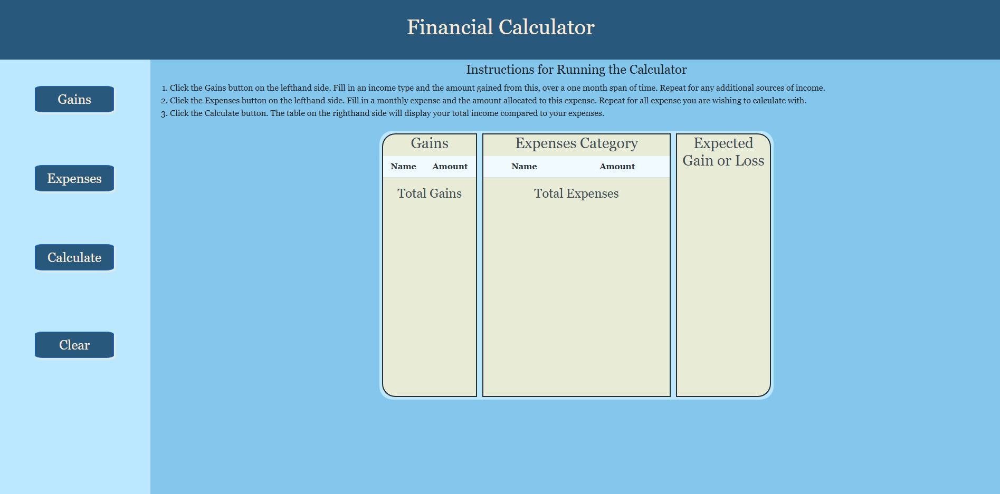
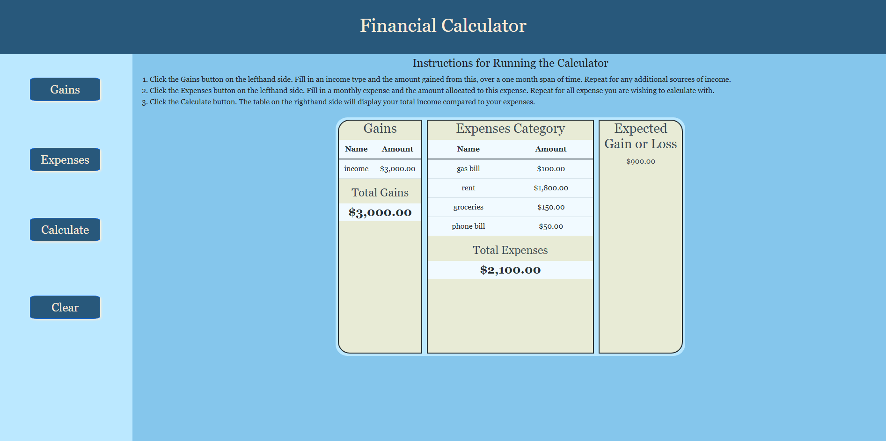

# <Financial-Calculator>
## Description
This site provides a way for users to track their income compared to their expense. We wanted to create a tool that would make it easier for people to track their financial wellbeing. It was also pratice in creating sites, and we learned a lot about working through issues in JavaScript and CSS. 
## Installation
Step 1, Open the link to GitHub pages.
## Usage
 Step 1. Click on the button labeled "Gains", and input both a name for the gain (such as "Income") you are trying to record and the amount it provides over one month.
 Step 2. Click on the button labeled "Expenses", and input both a name for the expense (such as "Gas Bill") and the amount you wish to spend on it over one month.
 Step 3. Click on the button labeled "Calculate", and the information you inputed, along with all being compared to each other, will populate on the right hand side in tables.
 Step 4. Click on the button labeled "Clear", to clear the tables and the inputed information if you wish.
    
    
    ```
## Credits
Collaborators:
- <a href="https://github.com/Hiemdier">Shane Anderson</a>
- <a href="https://github.com/lexusnealy">Lexus Nealy</a>
- <a href="https://github.com/Anshul1555">Anshul Sharma</a>
- <a href="https://github.com/dellis27">Cooper Ellis</a>
--- 


<a href="https://hiemdier.github.io/project-1-financial-calculator/">link</a>


